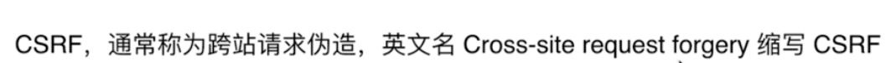
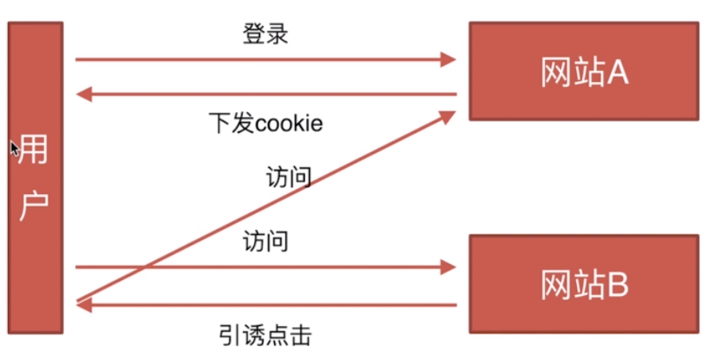
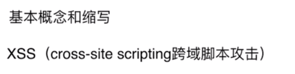

# 安全
- CSRF
- XSS
---
#### 1.CSRF
1. 基本概论和缩写

2. 攻击原理

用户C打开浏览器，访问受信任网站A，输入用户名和密码请求登录网站A；2、在用户信息通过验证后，网站A产生Cookie信息并返回给浏览器，此时用户登录网站A成功，可以正常发送请求到网站A；3、用户未退出网站A之前，在同一浏览器中，打开一个TAB页访问网站B；4、网站B接收到用户请求后，返回一些攻击性代码，并发出一个请求要求访问第三方站点A；5、浏览器在接收到这些攻击性代码后，根据网站B的请求，在用户不知情的情况下携带Cookie信息，向网站A发出请求。网站A并不知道该请求其实是由B发起的，所以会根据用户C的Cookie信息以C的权限处理该请求，导致来自网站B的恶意代码被执行。

3. 防御措施
- Token验证
- Referer验证
- 隐藏令牌

#### 2.XSS
