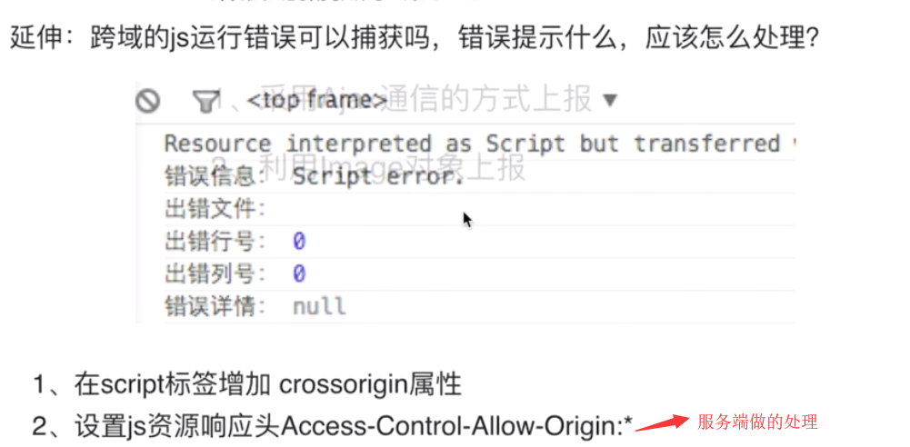

# 错误监控类

#### 1.前端错误的分类

- 及时运行错误：代码错误
- 资源加载错误

#### 2.错误的捕获方式

- 及时运行错误的捕获方式

  1) try…catch 

  2) window.onerror

- 资源加载错误

  1) object.onerror 

  2) performance.getEntries()
  能获取到加载成功的图片，再跟获取图片的标签的length进行相减

  3) Error事件捕获
  

  **延伸：跨域的js运行错误可以捕获吗，错误提示是什么，应该怎么处理**
  

#### 3.上报错误的基本原理

1. 采用ajax的方式上报
2. 利用image对象上报

