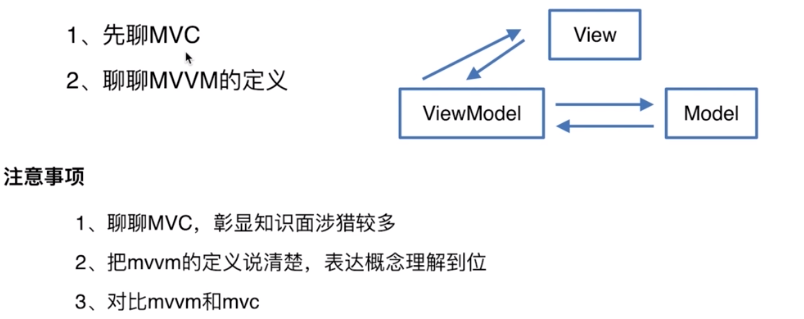
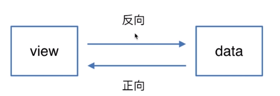
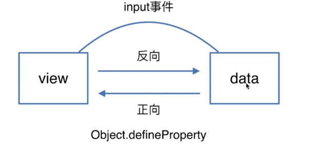
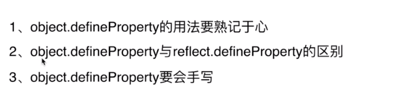
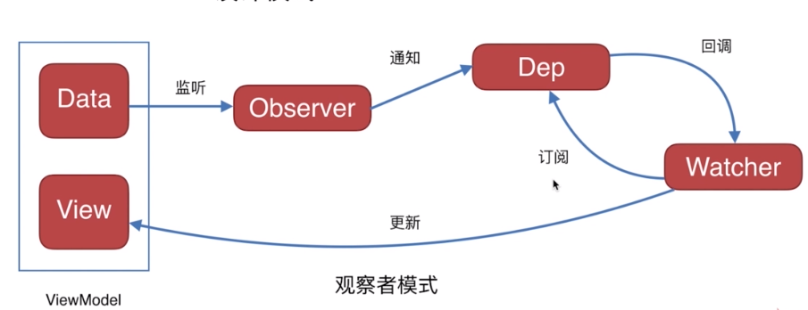
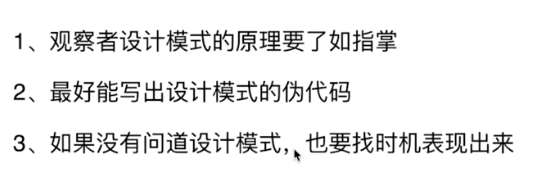
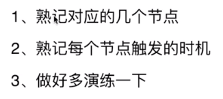

# MVVM

#### 1.了解MVVM框架吗？

Vue.js	React.js		Angular.js

注意事项：

 	1. 一定要想好说哪个
 	2. 收住优点，攒着下面说，开启引导模式
 	3. 话别说太满，低调谨慎，比喻不要说精通

#### 2.谈谈你对MVVM的认识？

#### 3.双向绑定是什么原理，可以写出来吗？

数据变了页面发生变化，页面的发生变化，数据也跟着变化，核心基本原理自动化，input变化，数据变化，

#### 4.使用了什么设计模式？

#### 5.生命周期是什么？
什么时候可以对页面中的DOM进行访问？在mounted，不要有背题的感觉

#### 6.有看过源码吗？

