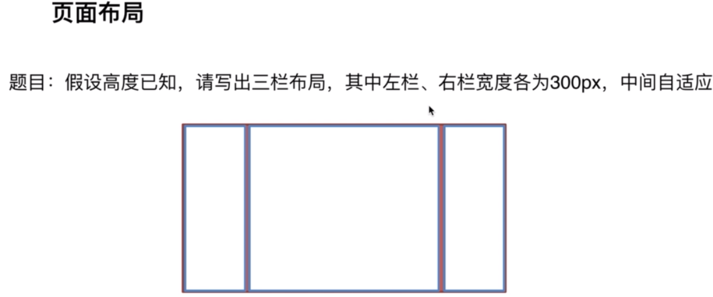
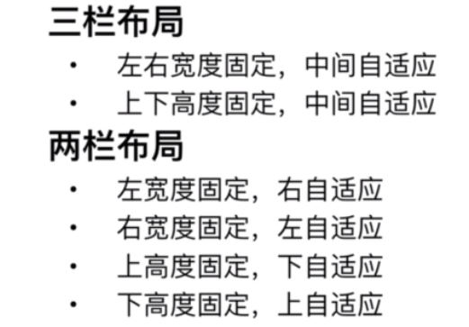

# 页面布局

这个题所要思考的三个问题：
1. 这个题真的像我们想象的这么简单吗？它要求你能写出更多的方案，至少不能少于3种，写出两种不及格，三种算及格，四种是优秀，五种是非常优秀。
2. 这个题的技巧在哪，在平时对css的一个掌握
3. 这道题目怎么延伸，这5种方案各自有什么优缺点？假设高度去掉，那个可以适应？这5种方案的兼容性，真正到业务中去用那个最实用；
- 浮动常见的问题是清除浮动，浮动是脱离文档流的，如果处理不好会带来很多的问题，优点是兼容性比较好。如果能处理好浮动和周围元素的关系，兼容性是比较好的。
- 绝对定位的好处是快捷，不容易出问题。它的缺点是：元素已经脱离文档流，所以它下面的子元素也要脱离文档流，所以它的可使用性比较差。
- flexbox布局是为了解决上述两个问题出现的。
- 表格布局：表格布局在历史上说是要摒弃掉，表格布局兼容性问题很好，缺点当其中一个单元格的高度变化的时候也会影响其它的两个。
- 网格布局：网格布局新出来的，通过网格布局可以做很多复杂的事情，网格布局比较简单，把新学的展示给面试管，说明你对技术是有追求，自主学习能力强

**如果去掉高度，那个方案不再适用**
1. 浮动去掉高度或者增加内容这个方案不能用，因为多出的内容脱离文档流会出现在left的下面，可以用BFC来解决
2. 绝对定位不可以，不给中间的元素高度，中间元素高度会随着内容的增减而变化
3. flexbox可以，所有的高度随内容发生变化
4. 表格布局，所有的高度随内容发生变化
5. 网格布局不行，增加中间的内容，高度不会变化，但是中间的内容超出


**答案是：**
```html
<!DOCTYPE html>
<html lang="en">
<head>
    <meta charset="UTF-8">
    <meta name="viewport" content="width=device-width, initial-scale=1.0">
    <meta http-equiv="X-UA-Compatible" content="ie=edge">
    <title>Document</title>
</head>
<body>
    <style>
        html *{
            margin: 0;
            padding: 0;
        }
        .layout {
            margin-top: 20px;
        }
        .layout article div {
            min-height: 100px;

        }
        
    </style>
    <!-- 1.浮动布局 -->
    <section class="layout float">
        <style>
            .layout.float .left {
                width: 300px;
                float: left;
                background: yellow;
            }
            .layout.float .right {
                width: 300px;
                float: right;
                background: blue;
            }
            .layout.float .center{
                background: red;
            }
        </style>
        <article class="left-right-center">
            <div class="left"></div>
            <div class="right"></div>
            <div class="center">
                <h1>浮动解决方案</h1>
                <p>这是三栏布局的中间部分</p>
            </div>
        </article>
    </section>
    
    <!-- 2.绝对定位布局 -->
    <section class="layout absolute">
        <style>
            .layout.absolute .left-right-center {
                position: relative;
                min-height: 100px;
            }
            .layout.absolute .left-right-center>div {
                position: absolute;
                top: 0;
            }
            .layout.absolute .left {
                left: 0;
                width: 300px;
                background: yellow;
            }
            .layout.absolute .right {
                right: 0;
                width: 300px;
                background: blue;
            }
            .layout.absolute .center{
                left: 300px;
                right: 300px;
                background: red;
            }
        </style>
        <article class="left-right-center">
            <div class="left"></div>
            <div class="center">
                <h1>绝对定位解决方案</h1>
                <p>这是三栏布局的中间部分</p>
            </div>
            <div class="right"></div>
        </article>
    </section>

    <!-- 3.flexbox布局 -->
    <section class="layout flexbox">
        <style>
            .layout.flexbox .left-right-center {
                display: flex;
            }
            .layout.flexbox .left {
                width: 300px;
                background: yellow;
            }
            .layout.flexbox .right {
                width: 300px;
                background: blue;
            }
            .layout.flexbox .center{
                flex: 1;
                background: red;
            }
        </style>
        <article class="left-right-center">
            <div class="left"></div>
            <div class="center">
                <h1>flexbox解决方案</h1>
                <p>这是三栏布局的中间部分</p>
            </div>
            <div class="right"></div>
        </article>
    </section>

    <!-- 4.表格布局 -->
    <section class="layout table">
        <style>
            .layout.table .left-right-center {
                display: table;
                width: 100%;
                height: 100px;
            }
            .layout.table .left-right-center>div {
                display: table-cell;
            }
            .layout.table .left {
                width: 300px;
                background: yellow;
            }
            .layout.table .right {
                width: 300px;
                background: blue;
            }
            .layout.table .center{
                background: red;
            }
        </style>
        <article class="left-right-center">
            <div class="left"></div>
            <div class="center">
                <h1>table解决方案</h1>
                <p>这是三栏布局的中间部分</p>
            </div>
            <div class="right"></div>
        </article>
    </section>

    <!-- 5.网格布局,网格布局，css要提出的grid布局 -->
    <section class="layout grid">
        <style>
           .layout.grid .left-right-center {
                display: grid;
                width: 100%;
                grid-template-rows: 100px;
                grid-template-columns: 300px auto 300px;
            }
            .layout.grid .left {
                background: yellow;
            }
            .layout.grid .right {
                background: blue;
            }
            .layout.grid .center{
                background: red;
            }
        </style>
        <article class="left-right-center">
            <div class="left"></div>
            <div class="center">
                <h1>网格解决方案</h1>
                <p>这是三栏布局的中间部分</p>
            </div>
            <div class="right"></div>
        </article>
    </section>
</body>
</html>
```

---
#### 总结
- 语义化要掌握到位，如上面的例子，每个块是section article表明是一个容器，div是三个块，标题是h1,内容是p，不要通篇div，这是语义化没有掌握好的原因。
- 页面布局理解要深刻，比喻说上面列举的方案，每个方案的原理要能说出来。
- CSS基础知识要扎实，如表格布局
- 思维灵活且积极上进，如果网格布局，是最新的，说明要关注热点，积极上进。思维灵活如知道每一个的优缺点。
- 代码书写好规范，通过命名快速掌握，如grid，缩进等

---
#### 页面布局的变通
