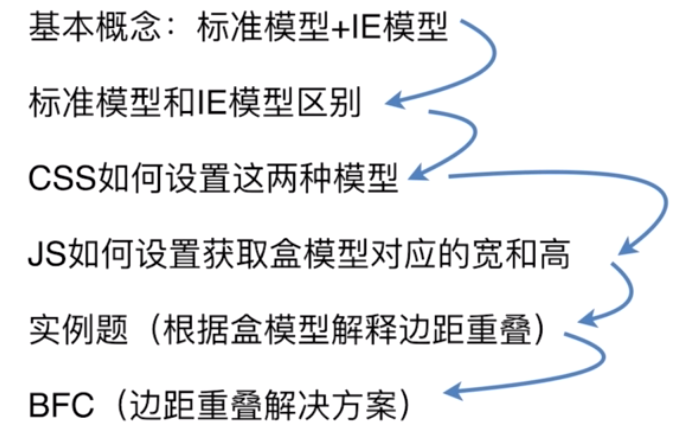
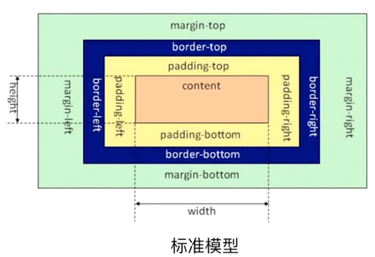
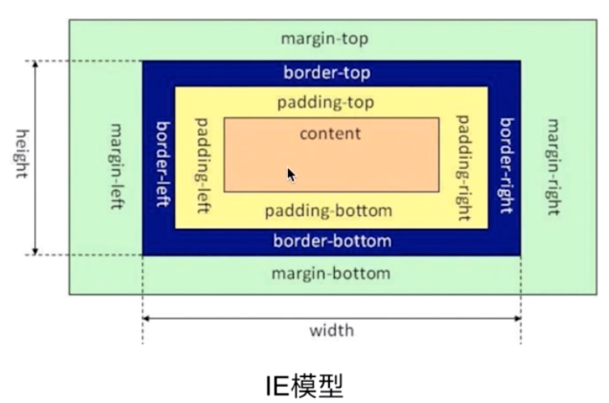
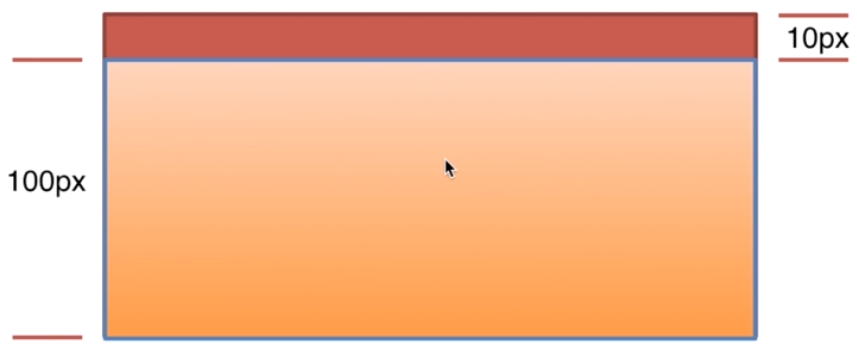

# CSS盒模型
##### 下面是常见并逐级深入的CSS盒模型面试


---
##### 1.基本概论：标准模型+IE模型
###### 标准模型


###### IE模型


##### 2.标准模型和IE模型的区别
标准模型跟IE模型的不同就是宽高的计算方式不同，标准模型的宽高指的是content的宽高不包括padding和border，IE模型的宽高是包括content、padding、border。

##### 3.CSS如何设置这两种模型
通过设置：
- box-sizing: content-box;这是标准模型，浏览器默认的模型
- box-sizing: border-box;这是IE模型

##### 4.JS如何设置获取盒模型对应的宽高
1. dom.style.width/height，这个不能取到所以元素的宽和高，CSS的写法有三种，第一种是行间样式，第二种是内联的style标签，第三种是外联样式表，那这个方法只能取到内联样式的宽和高，有局限性。
2. dom.currentStyle.width/height，兼容上面几种，只有IE支持
3. window.getComputedStyle(dom).width/height与2一样，但只有标准支持，低版本不支持
4. dom.getBoundingClientRect().width/height

##### 5.实例题(根据盒模型解释边距重叠)

上图父元素里子元素高100px，margin-top:10px；说出父元素的高度，两种答案：100px和110px，两种答案都对。


```html
<!DOCTYPE html>
<html lang="en">
<head>
    <meta charset="UTF-8">
    <meta name="viewport" content="width=device-width, initial-scale=1.0">
    <meta http-equiv="X-UA-Compatible" content="ie=edge">
    <title>Document</title>
    <style>
        * {
            margin: 0;
            padding: 0;
        }
    </style>
</head>
<body>
    <section id="sec">
        <style>
            #sec {
                background: yellow;
                /* overflow: hidden; 不加这个父元素的高度是100px，加上以后变成110px */
            }
            .child {
                height: 100px;
                margin-top: 10px;
                background: green;
            }
        </style>
        <article class="child"></article>
    </section>

    <!-- BFC垂直方向边距重叠 -->
    <section id="margin">
        <style>
            #margin {
                background: pink;
                overflow: hidden;/*创建BFC*/
            }
            #margin>p {
                margin: 5px auto 25px;
                background: red;
            }
        </style>
        <p>1</p>
        <p>2</p>
        <p>3</p>
    </section>

    <!-- BFC解决垂直方向边距重叠，给子元素再套一层父级，给父级创建BFC -->
    <section id="margin2">
        <style>
            #margin2 {
                margin-top: 20px;
                background: pink;
                overflow: hidden;/*创建BFC*/
            }
            #margin2 p {
                margin: 5px auto 25px;
                background: red;
            }
        </style>
        <p>1</p>
        <div style="overflow: hidden;">
            <p>2</p>
        </div>
        <p>3</p>
    </section>

    <!-- 左边宽度固定，右边自适应, 左侧浮动，当右侧的高度超过左侧时，左侧的下边会出现右侧的背景色，解决方法给右侧创建BFC，加overflow:auto;-->
    <section id="layout">
        <style>
            #layout {
                margin-top: 20px;
                background: blue;
            }
            #layout .left {
                float: left;
                width: 200px;
                background: gray;
                height: 100px;
            }
            #layout .right {
                background: purple;
                height: 110px;
                overflow: auto;
            }
        </style>
        <div class="left"> </div>
        <div class="right"></div>
    </section>

    <!-- BFC的另一个应用，清除浮动，BFC子元素即使是float也会参与高度计算 -->
    <section id="float">
        <style>
            #float {
                background: red;
                overflow: hidden;
                /* float: left; */
                margin-top: 20px;
            }
            #float .float {
                float: left;
                font-size: 24px;
            }
        </style>
        <div class="float">我是浮动元素</div>
    </section>
</body>
</html>
```
##### BFC(边距重叠解决方案)，会问如下的问题
1. BFC的基本概念：块级格式化上下文，与其并列的IFC内联元素格式化上下文
2. BFC的原理：就是BFC的渲染规则
-     在BFC这个元素的垂直方向的边距会发生重叠
-     BFC的区域不会和浮动元素的box重叠，这个也是用来清除浮动
-     BFC是一个独立的容器，外面的元素不会影响里面的元素，反之，里面的也不会影响外面的
-     计算BFC高度的时候，浮动元素也会参与计算
3. 怎样去创建BFC，
-     overflow
-     float值不为none
-     position值不是static和relative
-     display值是inlne和display是表格属性相关

4.BFC的使用场景


