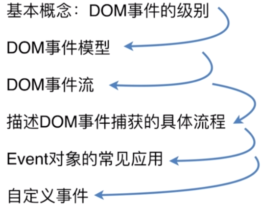
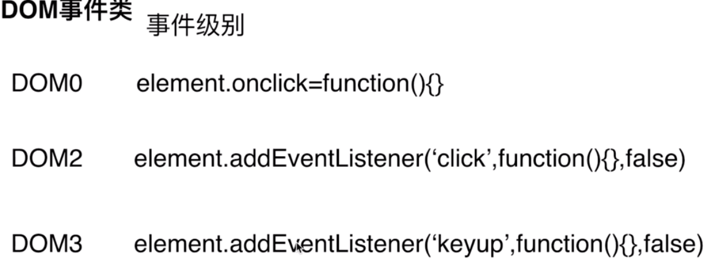
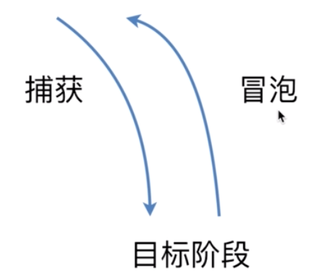
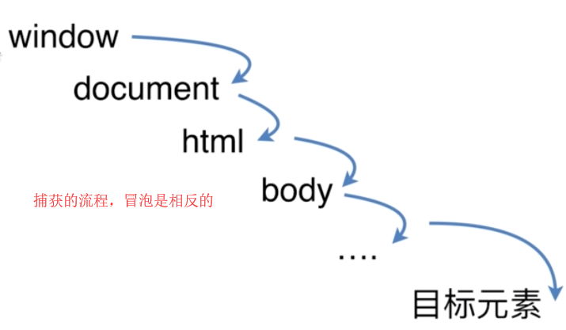
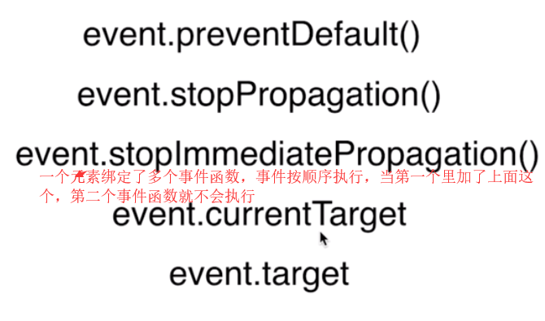
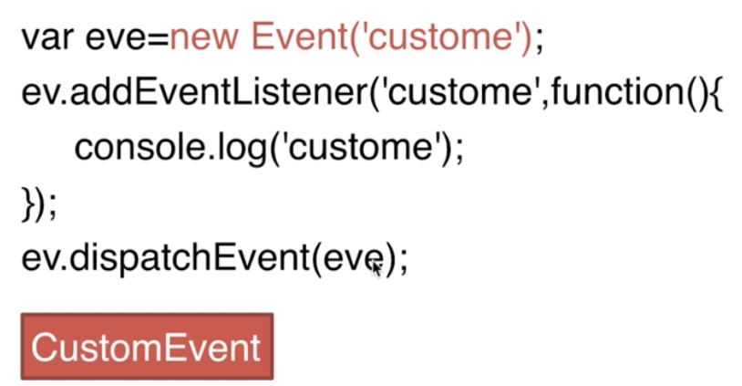

# DOM事件类

##### 1.DOM事件级别

##### 2.DOM事件模型

冒泡和捕获

##### 3.DOM事件流

事件流就是用户点击鼠标时事件的传递，它又怎么响应。事件通过捕获到达目标阶段，再从目标元素冒泡，最后到window元素

##### 4.描述DOM事件捕获的具体流程

##### 5.Event对象的常见应用

##### 6.自定义事件

缺点是：不能传递数据