# http协议类

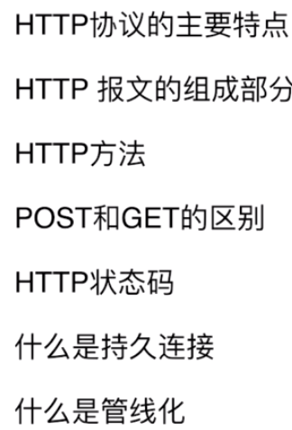

---
#### 1.http的主要特点

- 简单快速
- 灵活
- 无连接：连接一次就会断掉，不会保持连接
- 无状态：

#### HTTP报文的组成部分

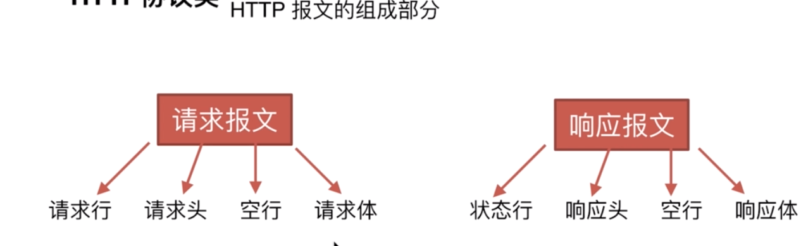
##### 请求报文
- 请求行：包含http方法，页面地址，http协议、版本
- 请求头：key value值
- 空行：告诉服务端往下不再是请求头，接下来就是请求体了
- 请求体
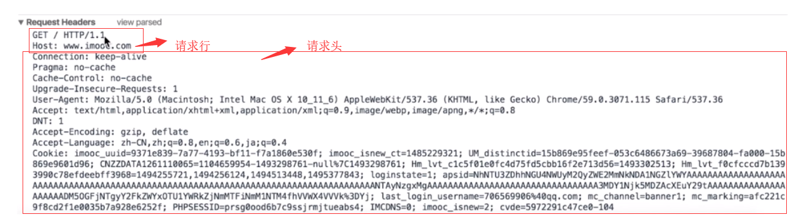
##### 响应报文
- 状态行：
- 响应头：
- 空行：
- 响应体：

#### HTTP方法
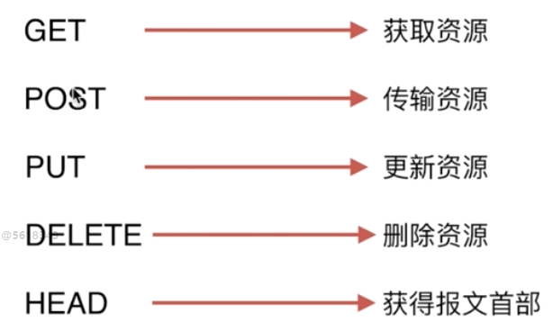

#### POST和GET的区别
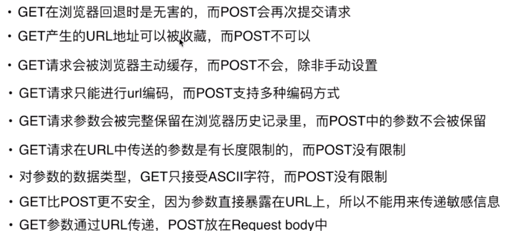

#### HTTP状态码
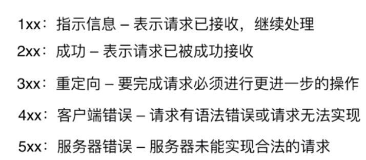
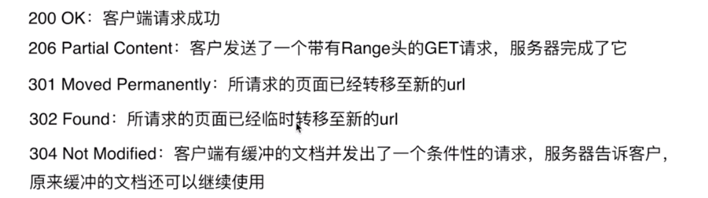
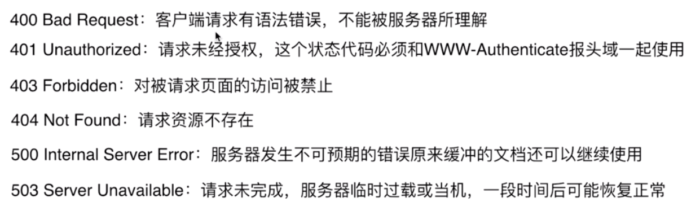

#### 什么是持久连接
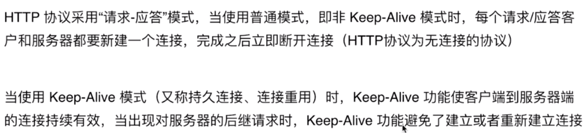
#### 管线化
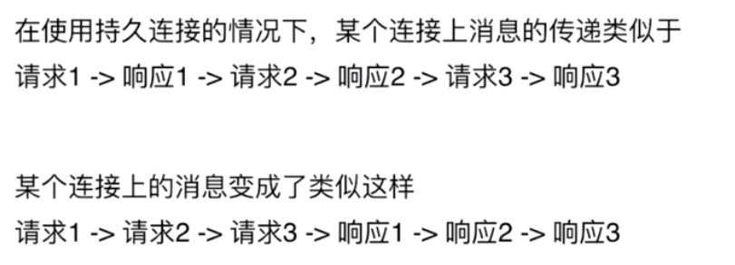
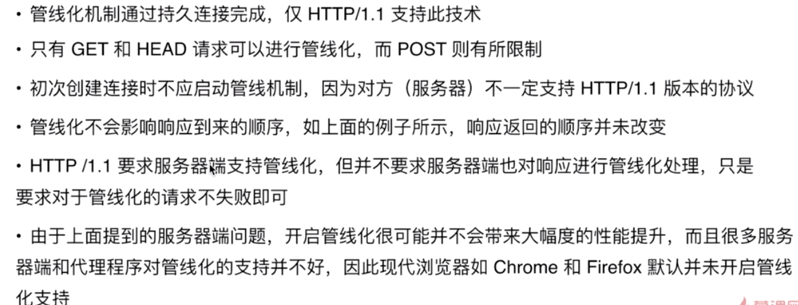