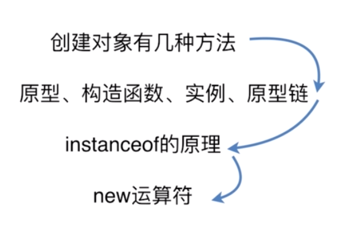
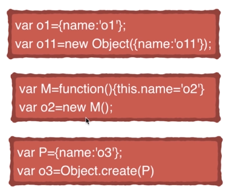
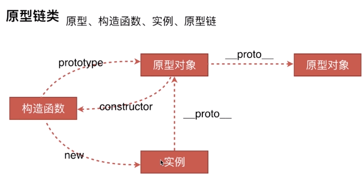
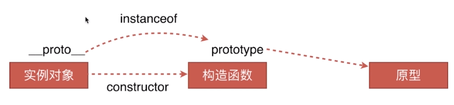
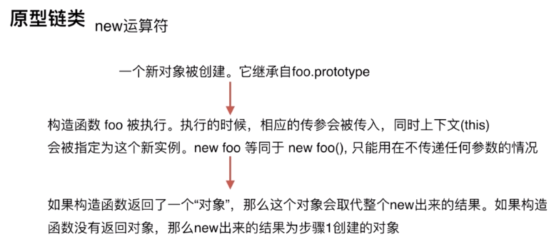

# 原型链



#### 1.创建对象有几种方法


#### 2.原型、构造函数、实例、原型链


#### 3.instanceof的原理


#### 4.new运算符


---
``` html
<!DOCTYPE html>
<html lang="en">
<head>
  <meta charset="UTF-8">
  <meta name="viewport" content="width=device-width, initial-scale=1.0">
  <meta http-equiv="X-UA-Compatible" content="ie=edge">
  <title>Document</title>
</head>
<body>
  <script>
    //====  原型、构造函数、实例、原型链
    var M = function() {this.name = 'o2';}
    var o2 = new M();
    M.prototype.sing = function() {alert(1)}
    //凡是通过new操作后面函数就不是普通的函数就是构造函数
    //被new调用后返回的就是实例
    //构造函数也是函数，函数都会有prototype,函数也是对象，他也有__proto
    //对象有__proto
    console.log(M.prototype.constructor === M);//true
    console.log(o2.__proto__ === M.prototype );//true
    console.log(M.__proto__ === Function.prototype);//true

    //====  instanceof的原理
    console.log(o2 instanceof M)//true
    console.log(o2 instanceof Object)//true
    console.log(M.prototype.__proto__ === Object.prototype);//true
    //所以用instanceof判断o2是不是M的实例不严谨，要判断严谨要用constructor，如下
    console.log(o2.__proto__.constructor === M);//true
    console.log(o2.__proto__.constructor === Object);//false

    //new 操作符原理
    var new2 =function(fn) {
      var o =Object.create(fn.prototype);
      var k = fn.call(o);
      if(typeof k == 'object') {
        return k
      }else {
        return o;
      }
    }

    //下面的这种创建方式不同在于，P就是原型
    var P = {name: '03'};
    var o3 = Object.create(P);
    console.log(o3.__proto__ === P);//true

  </script>
</body>
</html>

```

