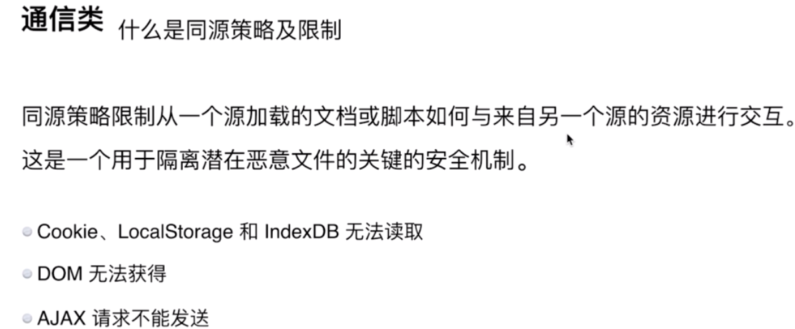
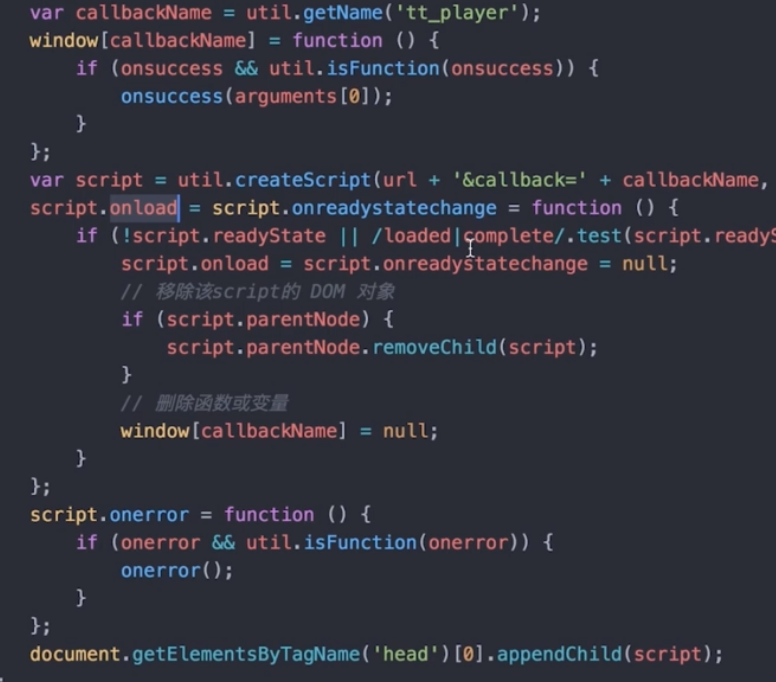
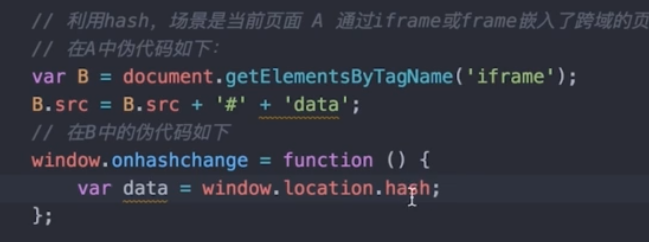
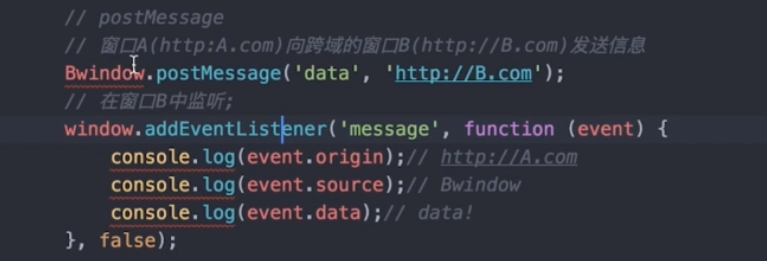
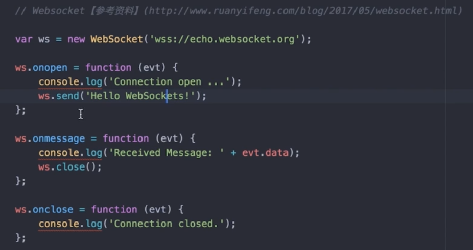
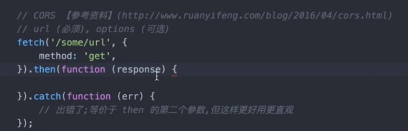

# 通信类
#### 1.什么是同源策略及限制
源表示协议、域名、端口，有一个不一样就是跨域了，不是一个源的文档是不能相互操作

#### 2.前后端如何通信
- Ajax
- WebSocket，不受同源策略的限制
- CORS：支持同源，支持跨域
#### 3.如何创建ajax，自己如何写出了
- XMLHttpRequest对象的工作流程
- 兼容性处理
- 事件的触发条件
- 事件的触发条件
#### 4.跨域通信的几种方式
- JSONP
    jsonp的实现原理,只能用get
    
- Hash：hash是指浏览器问好后面的，它的改变是不刷新页面，所以能做跨域

- postMessage：html5新增的

- WebSocket：不受同源策略影响

- CORS：支持跨域通信的ajax
